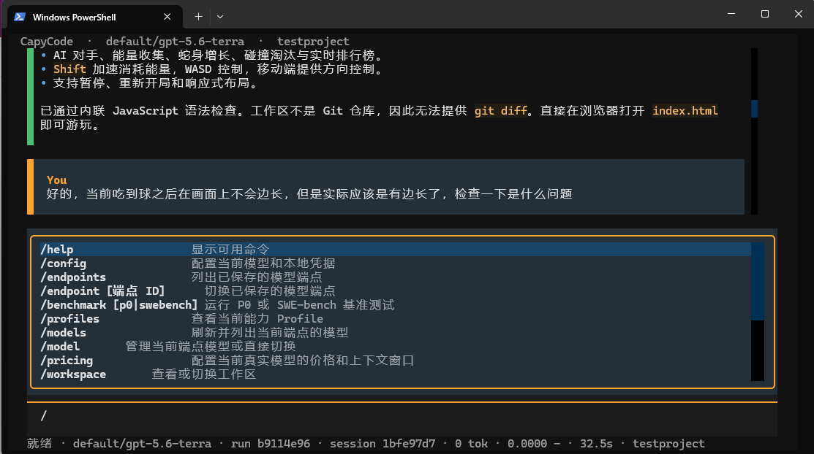
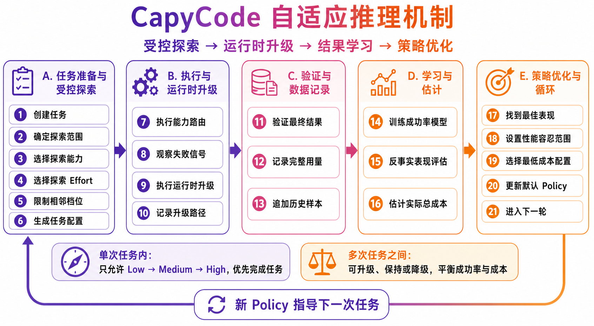
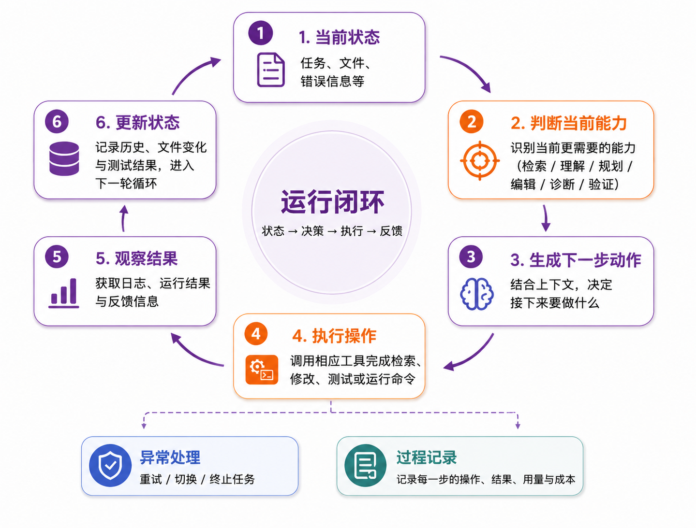

<div align="center">


# CapyCode

### 自适应推理的终端 Coding Agent

[](https://github.com/AusungSi/CapyCode/actions/workflows/ci.yml)
[](https://www.python.org/)
[](https://textual.textualize.io/)
[](#核心功能)

[项目简介](#项目简介) · [核心功能](#核心功能) · [安装方式](#安装方式) · [Quick Start](#quick-start) · [开发说明](#开发说明)

</div>

---

## 项目简介

CapyCode 是一个在本地终端运行的 Coding Agent。它可以理解自然语言任务，在指定代码仓库中检索文件、分析问题、修改代码、运行测试，并展示完整执行过程。

项目将一次开发任务拆分为检索、理解、规划、编辑、诊断和验证等能力阶段，为不同阶段选择合适的模型配置与推理强度。自适应机制会结合历史任务表现调整策略，在保证完成质量的同时控制 Token、时间和调用成本。

## 界面预览

<div align="center">



<sub>CapyCode 实际运行界面：对话、命令菜单、模型、会话与成本状态集中展示。</sub>

</div>

## 核心功能

| 功能 | 说明 |
| --- | --- |
| 自然语言编程 | 直接描述需求，由 Agent 完成分析、修改和验证 |
| 能力感知路由 | 根据当前步骤识别所需能力，并选择相应的模型、工具和上下文 |
| 自适应推理 | 根据历史成功情况与成本数据，逐步优化各能力的推理强度 |
| 安全工具调用 | 支持文件检索、内容读取、代码修改、命令执行、测试和 Git diff |
| 终端交互界面 | 提供流式输出、命令菜单、端点切换、模型选择和工作区管理 |
| 会话与运行记录 | 支持恢复历史会话，查看每次运行的步骤、Token、费用、耗时和修改结果 |
| 项目评测 | 支持 P0 基准、模型画像、路由策略比较和 SWE-bench 任务 |

### 自适应推理机制

自适应机制以一次完整开发任务为学习单位，在正常 Agent Loop 外增加受控探索和跨任务策略更新。完整流程如下：

<div align="center">



</div>

### Agent 运行闭环

<div align="center">



</div>

CapyCode 会持续读取当前状态、判断所需能力、生成下一步动作、调用工具并观察结果，直至任务完成或触发安全终止条件。每一步都会留下运行记录，便于检查和复现。

## 安装方式

### 环境要求

- Python 3.11 或更高版本
- Git
- uv
- Docker（仅运行 SWE-bench 时需要）

### 安装步骤

```powershell
git clone https://github.com/AusungSi/CapyCode.git
cd CapyCode

py -3.11 -m pip install uv
py -3.11 -m uv sync --locked --extra dev --extra adaptive
py -3.11 -m uv tool install --python 3.11 --editable --with scikit-learn .
```

确认安装成功：

```powershell
capycode --version
```

## Quick Start

在需要处理的项目目录中打开终端，运行：

```powershell
capycode
```

首次使用时输入 `/config`，依次填写端点名称、Base URL、API Key 和模型 ID。保存后，在输入框中直接描述任务即可：

```text
检查当前项目中失败的测试，定位原因并修复问题。
```

也可以直接运行单次任务：

```powershell
capycode run "分析登录模块并修复异常处理" --workspace . --max-steps 20
```

继续当前项目最近一次会话：

```powershell
capycode --continue
```

## 配置说明

CapyCode 支持 OpenAI-compatible 模型服务。推荐通过 TUI 中的 `/config` 完成配置，无需手动修改配置文件。

| 配置项 | 说明 |
| --- | --- |
| Endpoint ID | 本地保存的端点名称，可配置多个服务 |
| Base URL | 模型服务的 API 根地址 |
| API Key | 模型服务访问凭据 |
| Model ID | 服务端提供的真实模型名称 |
| Pricing | 输入、缓存输入和输出 Token 的价格 |
| Context Window | 模型上下文窗口大小 |

本地配置默认保存在 `~/.capycode/settings.json`。API Key、会话数据和运行记录不会提交到项目仓库。服务不支持模型列表接口时，可以直接手动填写模型 ID。

如需自定义不同能力使用的模型、工具和预算，可参考：

- `config/models.example.yaml`
- `config/profiles.example.yaml`
- `prompts/` 下的能力提示词

## 使用示例

可以向 CapyCode 提交以下类型的任务：

```text
解释这个项目的登录流程，并指出关键文件。

为用户接口增加参数校验，并补充对应测试。

检查当前失败的测试，定位回归原因并完成修复。

分析这次代码修改，运行相关测试并汇总风险。
```

TUI 常用命令：

| 命令 | 用途 |
| --- | --- |
| `/config` | 配置模型端点和凭据 |
| `/endpoint`、`/model` | 切换端点或模型 |
| `/profiles` | 查看当前能力配置 |
| `/workspace` | 查看或切换工作区 |
| `/runs` | 查看运行记录和代码改动 |
| `/resume`、`/continue` | 恢复历史会话 |
| `/benchmark` | 运行 P0 或 SWE-bench 基准 |
| `/help` | 查看完整命令列表 |

## 项目结构

```text
CapyCode/
├── src/capycode/   # Agent、TUI、路由、自适应机制和工具
├── config/         # 模型、能力与实验配置
├── prompts/        # 各能力阶段使用的提示词
├── tests/          # 单元、集成和协议测试
├── docker/         # SWE-bench 运行环境
└── README.md
```

## 开发说明

安装开发环境：

```powershell
py -3.11 -m uv sync --locked --extra dev --extra adaptive
```

提交前执行：

```powershell
py -3.11 -m uv run ruff check src tests
py -3.11 -m uv run ruff format --check src tests
py -3.11 -m uv run mypy src
py -3.11 -m uv run pytest
git diff --check
```

项目使用短生命周期功能分支，通过 PR 合并到 `main`。请勿提交 API Key、`.env`、本地会话、原始 Trace、虚拟环境或临时实验工作区。详细规范见 [CONTRIBUTING.md](CONTRIBUTING.md)。

---

<div align="center">

**Capability-aware · Observable · Adaptive**

</div>
